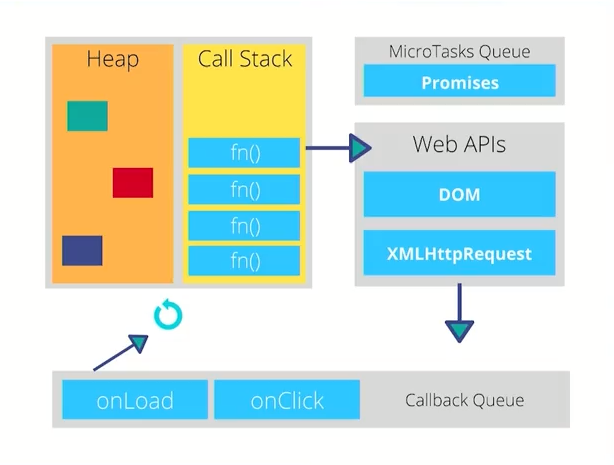

# Que es el asincronismo 

* Los lenguajes de programacion son sincronos 
* JavaScript es sincrono por defecto y tiene un subproceso (bloqueante, un unico hilo, single-threaded)
* Bloqueante: una tarea no devuelve el control hasta que se ha completado
* No bloqueante: una tarea devuelve inmediatamente el control. Si se completo devuelve los datos. Si no, un error.
* Sincrono: Secuencial esperar para que siga con la siguiente tarea 
* Asincrono: Las tareas pueden ser realizadas mas tarde

## Concurrencia 
modelo de concurrencia "loop de eventos"
* EventLoop: patron de diseño que espera y distribuye eventos o mensajes en un programa

## Forma JavaScript manejar la asicronia

* CallBacks: Una funcion que se pasa como argumento de otra funcion y que sera invocada
* Promesas: Funciones no-bloqueantes y asincrona la cual puede retornar un valor ahora, en el futuro o nunca.
* Async/Await: Estructurar una funcion asincrona sin bloqueo de una manera similar a una funcion sincrona ordinaria

JavaScript acaba de convertirse en Multi-Threaded con la capacidad de realizar multiples tareas simultaneamente

**JavaScript es asincrono y no bloqueante, con un bucle de eventos (concurrencia) implementado con un único hilo para sus interfaces I/O**

---

# EVENT LOOP  
**Tarea particular para mover del Task Que al Stack, solo si el Stack esta vacio**

## Memory Heap 
 Los objetos son aasignados a un monticulo (espacio grande de memoria no organizado) a ser utilizados

## Call Stack
Una pila (LIFO) de forma organizada de las instrucciones de nuestro programa 
## Task Queue
Cola (FIFO) de tareas, se maneja la concurrencia, se agregan las tareas que ya estan listas para pasar al Stack (pila) -> El stack debe de estar vacio
## MicroTask Queue
Las promesas tienen otra forma de ejecutarse y una prioridad superior
## Web APIs 
JavaScript del lado del cliente: setTimeout, XMLHttpRequest, File Reader, DOM.

